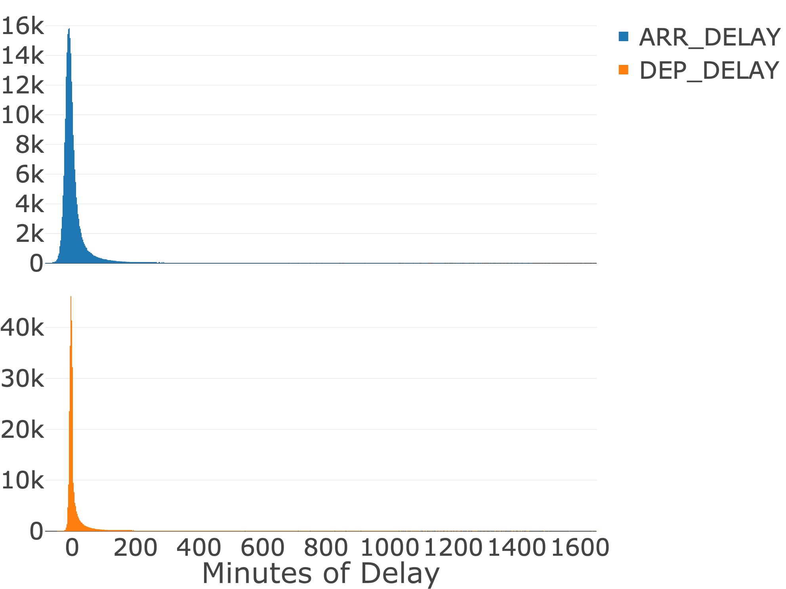
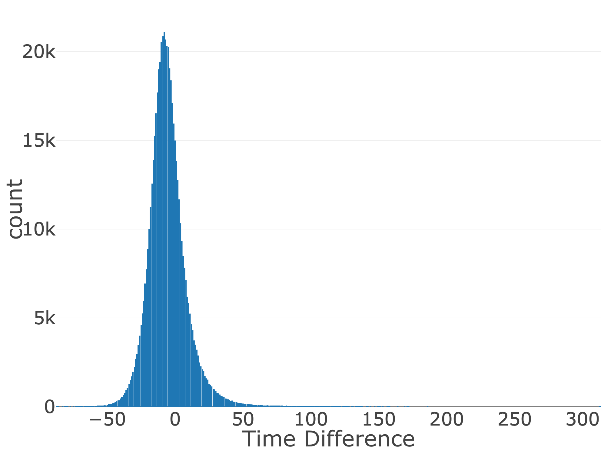
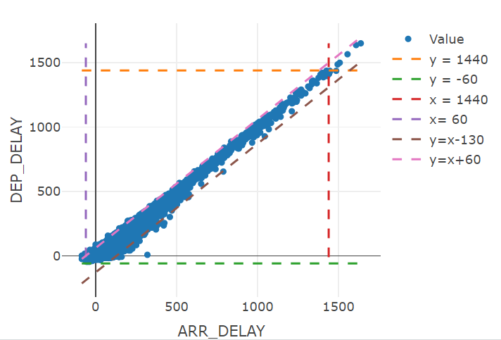
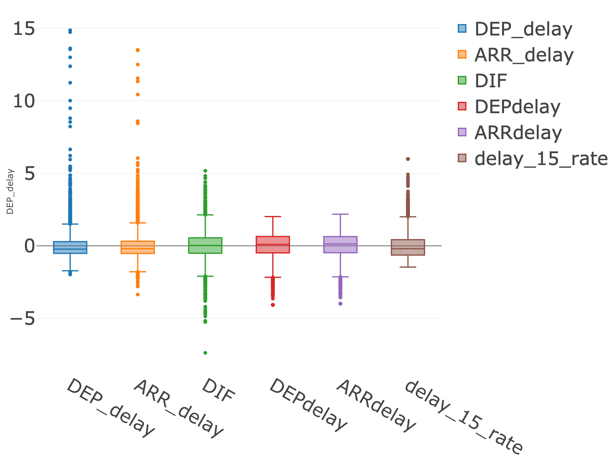
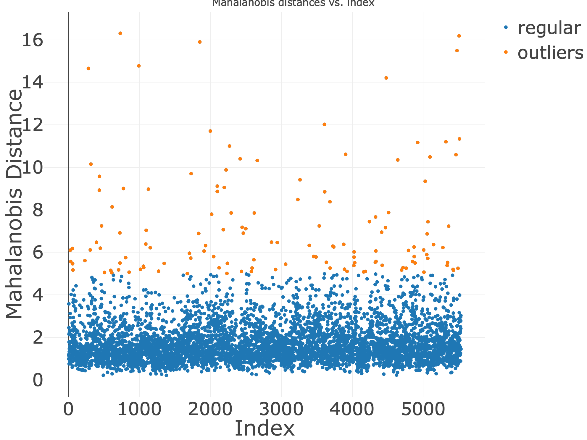
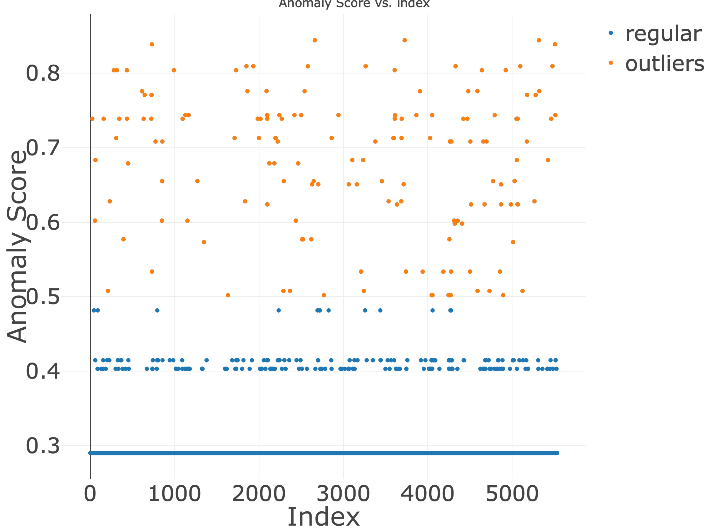

# Introduction

Outliers usually refer to points in the data that do not meet the characteristic rules, and are usually caused by experimental errors or incorrect inputs, including erroneous values or outliers that deviate from the mean. In data processing, outliers will greatly affect the results of regression or classification. Therefore, in the early stages of data processing, the detection and removal of outliers is inevitable. 

In this project, our goal was to employ various methods for identifying anomalous observations and analyzing outliers within a dataset on flight delays. In the first part, we employed traditional outlier detection tests, utilizing descriptive statistics to pinpoint outliers and presenting them visually. In the second part, we employed four anomaly detection models to identify outliers, accompanied by explanations for why these observations are considered outliers. Furthermore, our target audience comprises individuals with a foundational understanding of Probability and Statistics, aiming to facilitate their comprehension of outlier detection methodologies. 

```{r setup, include=FALSE}
knitr::opts_chunk$set(echo = FALSE, warning = FALSE)
library(dplyr)
library(plotly)
library(purrr)
library(tidyverse)
library(MASS)
library(Matrix)
library(dbscan)
library(randomForest)
library(IsolationForest)
library(kableExtra)
library(htmlwidgets)
library(webshot)
library(patchwork)
library(gridExtra)
library(kableExtra)

axisfont<-list(size=30)
mars<-list(l=0, r=0, b=0, t=20)
```

# Data Definition
The given data set "Flights1_2019_1" shows some flight delay information in the United States in January 2019. Preliminarily exploring the data and understanding the meaning of variables can help us lock in key information. Below is the data dictionary of metadata.  
```{r}
flights_1 <- read.csv("Flights1_2019_1.csv", header = TRUE)
flights <- flights_1[,-18]

#create data variable definition
DataDict<-data.frame(
  Variables=colnames(flights), 
  Example=sapply(flights, function(x) paste(as.character(head(unique(x),2)), collapse = ", ")),
  Number.Missing=sapply(flights, function(x) sum(is.na(x))),
  Meanings=c("Year of departure",
             "The day of week of departure",
             "Departure date",
             "An identification number assigned by US DOT to identify a unique origin airport",
             "An identification number assigned by US DOT to identify a unique origin airport at a given point of time",
             "An identification number assigned by US DOT to identify an origin city market",
             "City name of departure",
             "An identification number assigned by US DOT to identify a unique destination airport",
             "An identification number assigned by US DOT to identify a unique destination airport at a given point of time",
             "an identification number assigned by US DOT to identify a destination city market",
             "City name of arrival",
             "Destination state",
             "Departure delay",
             "Arrival time",
             "Arrival delay",
             "Arrival delay state: 0 if not delay, actual arrival delay if delay",
             "Whether delay is greater than 15 minutes"
            )
)

DataDict%>%remove_rownames()%>%kable(booktabs = TRUE,caption = "Data Dictionary")%>%
  kable_styling(font_size=10, latex_options=c("striped","scale_down","hold_position"))%>%
  column_spec(4, width = "30em")%>%
  row_spec(0,bold=TRUE)
```

Among them, "ORIGIN_AIRPORT_ID," "ORIGIN_AIRPORT_SEQ_ID," share a one-to-one relationship, allowing us to remove "ORIGIN_AIRPORT_SEQ_ID,". Similarly, "DEST_AIRPORT_ID," "DEST_AIRPORT_SEQ_ID," exhibit a one-to-one relationship, permitting the removal of "DEST_AIRPORT_SEQ_ID,".A city can have multiple airports and the weather condition in a city . While "ARR_DELAY," "ARR_DELAY_NEW," and "ARR_DEL15" do not match exactly, they offer similar information. By using the "ARR_DELAY" data, we can infer "ARR_DELAY_NEW" and "ARR_DEL15." Consequently, these two columns can be omitted. Following these adjustments, the dataset that initially comprised 18 columns now contains only 12 columns.
```{r}
flights<- na.omit(flights)
index<-c(1,5,9,16,17)
flights<-flights[,-index]
flights$ARR_TIME <- sprintf("%04d",flights$ARR_TIME)
flights$ARR_TIME <- paste0(substring(flights$ARR_TIME, 1, 2), ":", substring(flights$ARR_TIME, 3, 4))
flights$ARR_TIME <- strptime(flights$ARR_TIME, format = "%H:%M") 
flights$ARR_TIME <- format(flights$ARR_TIME, format = "%H:%M")
```

# Visualization

To identify outliers, it's crucial to leverage key variables like arrival delay and departure delay. These variables are particularly informative because a flight cannot arrive excessively early or depart excessively late. As a result, we crafted Figure 1 to visualize the distribution of arrival delays.Upon examining Figure 1, a noticeable decline is evident when the arrival delay is less than -58 and the departure delay is less than -53. This observation underscores the significance of these thresholds in understanding the distribution and potential outliers in the context of flight delays.
```{r}
numb3<-group_by(flights,ARR_DELAY)%>%summarise(count=n())
p1<-plot_ly(numb3, x = ~ARR_DELAY, y = ~count, type = "bar", name = "ARR_DELAY") %>%
  layout( xaxis = list(title = "Minutes of delay" ,titlefont = list(size = 36)), yaxis = list(title = "Count" ,titlefont = list(size = 36)))%>%
  layout(margin=mars,
         xaxis=list(tickfont=axisfont),
         yaxis=list(tickfont=axisfont),
         legend = list(font = axisfont)
         )
numb4<-group_by(flights,DEP_DELAY)%>%summarise(count=n())
p2<-plot_ly(numb4, x = ~DEP_DELAY, y = ~count, type = "bar", name = "DEP_DELAY") %>%
  layout(xaxis = list(title = "Minutes of Delay",titlefont = list(size = 36)), yaxis = list(title = "Count",titlefont = list(size = 36)))%>%
  layout(margin=mars,
         xaxis=list(tickfont=axisfont),
         yaxis=list(tickfont=axisfont),
         legend = list(font = axisfont)
         )
  
p3<-subplot(p1, p2, nrows = 2, titleX = TRUE, shareX = TRUE)
saveWidget(widget = p3, file = "./Figures/dis_del.html")
shots<-webshot(url = "./Figures/dis_del.html", file = "./Figures/dis_del.png", delay = 1, zoom = 2)
```

```{r, out.width="70%", echo=FALSE,fig.align='center', fig.cap = "The Distribution of Delay"}

```

We also need to consider the time difference between arrival delay and departure delay. For instance, if a flight's departure delay is 1440 minutes and its arrival delay is 0 minutes, it becomes challenging to explain why the actual flight time is a day earlier than the expected flight time. Therefore, we identify data points where the time difference is excessively large as potential outliers, even if the arrival and departure delays individually seem reasonable. Figure 2 illustrates the distribution of these time differences.

\begin{minipage}[t]{0.5\textwidth}
```{r}
numb1<-flights$ARR_DELAY-flights$DEP_DELAY%>%as.data.frame()
colnames(numb1)<-c("dif")
sample_mean <- mean(numb1$dif, na.rm = TRUE)
sample_sd <- sd(numb1$dif, na.rm = TRUE)
numb1$FL_DATE<-flights$FL_DATE
numb2<-group_by(numb1,dif)%>%summarise(count=n())
p4<-plot_ly(numb2, x = ~dif, y = ~count, type = "bar", name = "Value") %>%
  layout(xaxis = list(title = "Time Difference",titlefont = list(size = 36)), yaxis = list(title = "count",titlefont = list(size = 36)))%>%
  layout(margin=mars,
         xaxis=list(tickfont=axisfont),
         yaxis=list(tickfont=axisfont),
         legend = list(font = axisfont)
         )

saveWidget(widget = p4, file = "./Figures/dis_gap.html")
shots<-webshot(url = "./Figures/dis_gap.html", file = "./Figures/dis_gap.png", delay = 1, zoom = 2)
```

```{r, out.width="80%",  fig.cap = "The Distribution of Time Difference"}

```
\end{minipage}
\begin{minipage}[t]{0.5\textwidth}
\vspace{0pt}
```{r}
p5<-plot_ly(flights, x = ~ARR_DELAY, y = ~DEP_DELAY, type = "scatter",mode = "markers", name = "Value") %>%
layout(xaxis = list(title = "ARR_DELAY"), yaxis = list(title = "DEP_DELAY"))%>%
add_lines(y = 1440, mode = "lines", name = "y = 1440", line = list(dash = 'dash')) %>%
  add_lines(y = -60, mode = "lines", name = "y = -60", line = list(dash = 'dash'))%>%
  add_lines(x = 1440, mode = "lines", name = "x = 1440", line = list(dash = 'dash'))%>%
  add_lines(x = -60 , mode = "lines", name = "x= 60", line = list(dash = 'dash'))%>%
  add_lines(x = flights$ARR_DELAY, y=flights$ARR_DELAY-130,mode = "lines", name = "y=x-130", line = list(dash = 'dash'))%>%
  add_lines(x = flights$ARR_DELAY, y=flights$ARR_DELAY+60 , mode = "lines", name = "y=x+60", line = list(dash = 'dash'))
```

```{r, out.width="100%", fig.cap = "Delay Time"}

```
\end{minipage}

We've crafted a scatter plot to illustrate both arrival delay and departure delay, along with the time gap between them, all within the same chart. To enhance the insights, we've incorporated six guiding lines. The lines 'x=-60' and 'x=1440' help identify flights arriving more than 60 minutes ahead of schedule and those arriving later than planned by 1440 minutes, respectively. Similarly, the lines 'y=-60' and 'y=1440' assist in spotting departures occurring earlier than the scheduled time by 60 minutes and later by 1440 minutes. The lines 'y=x+60' and 'y=x+130' highlight flights where the time difference between departure and arrival seems unusual. Points falling outside the hexagon formed by these lines could potentially be considered outliers.

After visualizing, we found the variables, like "Data", "Time", are useless. In addition, this data set has too many samples to analysis. Therefore, the next step is to build a new data set. Considering that many flights share the same departure airport and arrival airport, these flights are on the same route and under the same management conditions. We group the metadata by departure and arrival airports so that each route contains average delay information for all flights operating on that route.The reason for calculating the average information is it can help us rule out some extreme situations, such as severe weather. We form new variables for our subset through calculations between metadata variables. The data dictionary of subset is as follows.
```{r}
data <- suppressMessages(group_by(flights,ORIGIN_AIRPORT_ID,DEST_AIRPORT_ID) %>% 
  summarise(DEP_delay = mean(DEP_DELAY), 
            ARR_delay = mean(ARR_DELAY), 
            DIF = ARR_delay - DEP_delay,
            DEPdelay=sum(DEP_DELAY <=0)/n(),
            ARRdelay=sum(ARR_DELAY <=0)/n(),
            delay_15_rate = sum(ARR_DELAY >=15)/n()))
df1 <- data[,3:8] 
df2 <- data[,3:8]
df2<-df2%>%as.data.frame()

DataDict_subset<-data.frame(
  Variables=colnames(df1), 
  Example=sapply(df1, function(x) paste(as.character(head(unique(x),2)), collapse = ", ")),
  Number.Missing=sapply(df1, function(x) sum(is.na(x))),
  Meanings=c("Departure delay",
             "Arrival delay",
             "Trip delay time",
             "On-time departure rate of aircraft on specific routes",
             "On-time arrival rate of aircraft on specific routes",
             "The proportion of arrival delays for aircraft on specific routes exceeding 15 minutes"
            )
)

DataDict_subset%>%remove_rownames()%>%kable(booktabs = TRUE,caption = "Data Dictionary for using dataset")%>%
  kable_styling(font_size=10, latex_options=c("striped","scale_down","hold_position"))%>%
  column_spec(4, width = "30em")%>%
  row_spec(0,bold=TRUE)
```
We generated a box plot using a new dataset. To enhance the visibility of outliers, we standardized the data. Upon inspecting the chart, we identified points lying beyond the second and third quartiles, classifying them as outliers.
```{r}
df1<-scale(df1)%>%as.data.frame()
p10<-plot_ly(df1, y = ~DEP_delay, type = "box",name = "DEP_delay") %>%
  add_trace(y = ~ARR_delay,  type = "box",name = "ARR_delay") %>%
  add_trace(y = ~DIF, type = "box", name = "DIF") %>%
  add_trace(y = ~DEPdelay, type = "box",name = "DEPdelay") %>%
  add_trace(y = ~ARRdelay, type = "box",name = "ARRdelay") %>%
  add_trace(y = ~delay_15_rate, type = "box", name = "delay_15_rate")%>%
  layout(margin=mars,
         xaxis=list(tickfont=axisfont),
         yaxis=list(tickfont=axisfont),
         legend = list(font = axisfont)
         )
saveWidget(widget = p10, file = "./Figures/boxall.html")
shots<-webshot(url = "./Figures/boxall.html", file = "./Figures/boxall.png", delay = 1, zoom = 2)
```

```{r, echo=FALSE,out.width="50%", fig.align='center',fig.cap = "box chart of all variabels"}

```
# Method

## Distance base: Mahalanobis Distance

A quick way to screen out anomalous observations is to compare distances. A quick way to screen out anomalous observations is to compare distances. For example, we want to calculate how far a sample point p$x=(x_1,...x_n)$ is from a distribution with mean $\mu=(y_1,...,y_n)$to verify whether p belongs to this distribution. One of the most common methods is to calculate the distance between p and the mean of the sample and compare it with the standard deviation of the sample. For a multidimensional data, if each variable shares the same unit of measurement, then the data set can be visually viewed as a sphere, and Euclidean distance can be applied well with the given Euclidean distance formula $d_E=\sqrt{\sum_{i=1}^{n}(x_i-y_i)^2}$  
However, Euclidean distance has problems with certain multidimensional data. Considering the formula of Euclidean distance, we can easily find that Euclidean distance treats every eigenvalue equally. A simple example is when we have a data with two columns of feature values, the first column is in minutes and the second column is in hours. When we apply the Euclidean distance formula, the impact or contribution of the first column is significantly stronger than that of the second column. This result makes the second column of information seem insignificant. The influence of the second column features is reduced when judging outliers. If the data distribution is not spherical, such as an ellipsoid, the lengths of the visual data on the long and short axes are obviously different, and the standard deviation has a scale problem, we should improve the Euclidean distance.  
Mahalanobis Distance can be seen as a correction of Euclidean distance, which corrects the problem of inconsistent scales of various dimensions in Euclidean distance. Given Mahalanobis Distance $d_M=\sqrt{(x-\mu)^{\intercal}\Sigma^{-1}(x-\mu)}$, where $\Sigma$ is the covariance matrix of the sample. When the inverse of $\Sigma$ exists, the Mahalanobis distance is insensitive to the standard deviation scale issue, the versatility is improved.
Mahalanobis distance is more suitable for our subset because the subset we are using suffers from scale issues. Delay is measured in minutes, while on-time performance is a ratio between 0 and 1. If we ignore the scale issue, the consequence is that the outliers found are only based on some particular features.

```{r}
Distance <- function(df){
  mean_vector <- colMeans(df)
  S <- cov(df)
  S_reg <- nearPD(S)$mat
  d_square <- mahalanobis(df,center = mean_vector, cov = S_reg)
  d_M = sqrt(d_square)
  return(d_square)
}

d_square <- Distance(df1)
```

```{r}
# plot
plot_d_square <- data.frame(d_square)
mp1<-ggplot(plot_d_square, aes(x = d_square)) +
  geom_histogram(binwidth = 1, fill = "lightblue", color = "black", boundary = 0) +
  labs(title = "Histogram of Mahalanobis Distances",
       x = "Squared Mahalanobis Distance",
       y = "Frequency")

plot_d <- data.frame(d = sqrt(d_square))
mp2<-ggplot(plot_d, aes(x = d)) +
  geom_histogram(binwidth = 0.1, fill = "lightblue", color = "black", boundary = 0) +
  labs(title = "Histogram of Mahalanobis Distances",
       x = "Mahalanobis Distance",
       y = "Frequency")

d_clean <- sqrt(d_square)[sqrt(d_square) < 5]
d_cleandf <- data.frame(d_clean)
mp3<-ggplot(d_cleandf, aes(x = d_clean)) +
  geom_histogram(aes(y=..density..),
    binwidth = 0.1, fill = "lightblue", color = "black", boundary = 0) +
  labs(title = "Histogram of Mahalanobis Distances (Excluding Outliers)",
       x = "Mahalanobis Distance",
       y = "Density") +
  geom_density(alpha=.2, fill="#FF6666")

plot_data_1 <- plot_ly(x = seq_along(sqrt(d_square)), y = sqrt(d_square), type = "scatter", mode = "markers", marker = list(color = "cyan3"), 
                     text = paste("Index: ", seq_along(sqrt(d_square)), "<br>Mahalanobis Distance: ", round(sqrt(d_square), 2)),
                     name = "regular") %>%
  layout(title = "Mahalanobis distances vs. index",
         xaxis = list(title = "Index",titlefont = list(size = 36)),
         yaxis = list(title = "Mahalanobis Distance",titlefont = list(size = 36)))%>%
  layout(margin=mars,
         xaxis=list(tickfont=axisfont),
         yaxis=list(tickfont=axisfont),
         legend = list(font = axisfont)
         )

# Identify and plot points with Mahalanobis distance greater than 5
high_dist_points <- which(sqrt(d_square) > 5)
if (length(high_dist_points) > 0) {
  plot_data_1  <- add_trace(plot_data_1 ,
                         data = data.frame(x = high_dist_points, y = sqrt(d_square)[high_dist_points]),
                         x = ~x, y = ~y, mode = "markers", type = "scatter", marker = list(color = "indianred2"),
                         text = paste("Index: ", high_dist_points, "regular: ", round(sqrt(d_square)[high_dist_points], 2)),
                         name = "outliers")
}
saveWidget(widget = plot_data_1 , file = "./Figures/Mahalanobis.html")
shots<-webshot(url = "./Figures/Mahalanobis.html", file = "./Figures/Mahalanobis.png", delay = 1, zoom = 2)
```

\begin{minipage}[t]{0.50\textwidth}
```{r, out.width="100%", fig.cap = "Comparsion of Distribution"}
grid.arrange(mp1, mp2, mp3)
```
\end{minipage}
\begin{minipage}[t]{0.50\textwidth}
\vspace{0pt}
```{r,out.width="93%", fig.cap = "Distance vs. index"}

```
\end{minipage}

The graph reflects the Mahalanobis distance of each point to the mean. Suppose we set the threshold to 5, and points exceeding the threshold are marked in red. We can see that the Squared Mahalanobis distance in the results conforms to the chi-square distribution, and the Mahalanobis distance basically conforms to the normal distribution with long tail. When we remove the parts that exceed the threshold, the distribution becomes more normal.

```{r}
dis_colors <- ifelse(sqrt(d_square) > 5, "indianred2", "cyan3")
# plot(df1,col = dis_colors)
```

```{r}
calculate_stats <- function(data, remove_indices) {
  original_mean <- colMeans(data)
  original_sd <- apply(data, 2, sd)
  
  # remove outliers
  modified_data <- data[-remove_indices, ]
  modified_mean <- colMeans(modified_data)
  modified_sd <- apply(modified_data, 2, sd)
  
  result_df <- data.frame(
    Dimension = 1:ncol(data),
    Original_Mean = original_mean,
    Original_SD = original_sd,
    Modified_Mean = modified_mean,
    Modified_SD = modified_sd
  )
  return(result_df)
}
```

```{r}
result_table <- calculate_stats(df2, c(which(sqrt(d_square) > 5)))
kable(result_table, format = "markdown", caption = "Comparison of Means and SDs for Distance Method")
```

Table 3 provides feedback on the changes in the mean and standard deviation of each variable before and after removing outliers. "Original" means before removal, and "Modified" means after removal. We can see that after removing outliers, the mean has shifted, and more importantly, the standard deviation of each dimension has decreased. When we remove outliers from the data, the standard deviation of the data will tend to decrease. This is a method to validate outliers. Another method is to compare the density visualizations before and after. Since the data set is large, yet the proportion of outliers is not large, all visualization effects are not obvious. Hence it is not included here.

## Density base

## LOF 

When we encounter two clusters, c1 and c2 have very different densities and the two clusters are far apart, if there is an outlier that is closer to the denser c1, but itself is isolated, then the distance-based method will failed.[@SmitiAbir2020Acoo] This is one of the reasons why we introduced the LOF (Local Outlier Factor) algorithm.
The basic idea of the LOF algorithm is to calculate a local reachable density of each data point based on the data density around the data point, and then further calculate an outlier factor of each data point through the local reachable density. The factor identifies the outlier degree of a data point. If the factor is close to 1, it means that the local density of the point is similar to the neighborhood density. If the factor is less than 1, it means that the local density of the point is higher than the neighborhood density, and the point is marked as a normal point. If the factor is greater than 1, it means that the local density of the point is lower than the neighborhood density and the point may be abnormal.

```{r}
lof_scores <- lof(df1,12)
# hist.default(lof_scores, breaks = 10, main = "LOF (minPts = 12)")
df3 <- data.frame(Value = lof_scores)

# Plot density using ggplot2
p10 <- ggplot(df3, aes(x = Value)) +
  geom_density(fill = "skyblue", color = "black") +
  xlab("LOF score") +
  ylab("Density")
outliers_lof <- which(lof_scores > 2)
outliers_scores <- lof_scores[outliers_lof]
lof_colors <- ifelse(lof_scores > 2, "indianred2", "cyan3")
#plot(df1,col = lof_colors)
```

\begin{minipage}[t]{0.65\textwidth}
```{r,out.width="100%", fig.cap = "LOF Score Density"}
p10
```
\end{minipage}
\begin{minipage}[t]{0.30\textwidth}
\vspace{0pt}
Drawing shows the distribution of LOF scores. This graph can provide us with an inspiration for choosing a threshold. Based on the lof score, the further it is greater than 1, the more likely it is to be an outlier. Choosing a threshold is challenging and at best requires domain knowledge. In the absence of domain background, we can view the distribution of outliers by appropriately adjusting the threshold while observing the matrix plot marking the outliers points.
\end{minipage}

```{r}
result_table <- calculate_stats(df2, c(which(lof_scores > 1.5)))
kable(result_table, format = "markdown", caption = "Comparison of Means and SDs for LOF")
```

## DBSCAN

DBSCAN (Density-Based Spatial Clustering of Applications with Noise) is a density-based clustering algorithm which has ability to divide regions with sufficiently high density into clusters. It can identify anomaly points and exclude them from the clustering results. For each cluster in the results, the density within the cluster is higher than the density at the edge of the cluster. The density of outliers is lower than the density of edges. According to the data distribution characteristics, the algorithm uses density differences to identify different density areas and marks the clustering results. [@DengDingsheng2020DCAB] The DBSCAN algorithm needs to set two important global constant parameters: $\epsilon$ and minPts. $\epsilon$ sets the radius of the sample point neighborhood range. minPts is the minimum number of sample points marked as core points within the neighborhood radius. This can be both an advantage and a disadvantage of this algorithm. The advantage is that we do not need to know in advance how many clusters the data should be divided into. The disadvantage is that the results are very sensitive to the parameter settings. If the parameters are set improperly, the clustering quality will be significantly reduced. This is a huge challenge for analysts. Usually to determine the optimal minPts, we need to set the parameter to the number of data dimensions + 1 and gradually increase it. In most cases, professional domain knowledge will become an important consideration in parameter setting. In the absence of professional domain knowledge, people usually set minPts to 2 times the number of data feature dimensions.  
One way to estimate the optimal $\epsilon$ is to use the k-nearest neighbor algorithm. The method is to calculate the distance between each point and its nearest/nearest neighbor. Then draw a k distance curve. Select the epsilon corresponding to the position of the maximum curvature of the K-dist curve. [@YinLifeng2023IoDA] 

\begin{minipage}[t]{0.50\textwidth}
When we give a fixed minPts = 12, we calculated the distance to the nearest neighbor of k=12, and then sort the distances in ascending order, as shown in the above figure. The x-axis is the distance number, and the y-axis is the distance value. We can see that the image has an obvious inflection point. This inflection point has the maximum curvature, and the corresponding epsilon is suitable. Through this method we selected two global parameter constants of DBSCAN for our data set.
\end{minipage}
\begin{minipage}[t]{0.50\textwidth}
\vspace{0pt}
```{r, out.width="100%", fig.cap = "K-nearest Neighbor"}
kNNdistplot(scale(df1), minPts = 12)
abline(h = 1.8, lty = 2)
```
\end{minipage}


```{r}
cat("DBSCAN result is presented as follow:")
dbscan_result <- dbscan(scale(df1), eps =1.8, minPts =12)
print(dbscan_result)
```

```{r}
dbscan_colors <- ifelse(dbscan_result$cluster == 0, "indianred2", "cyan3")
# plot(df1,col = dbscan_colors)

result_table <- calculate_stats(df2, c(which(dbscan_result$cluster == 0)))
kable(result_table, format = "markdown", caption = "Comparison of Means and SDs for DBSCAN")
```

The DBSCAN results show that 67 points are marked as outliers. Observing the table 5 shows that the standard deviation decreases after removing the outliers. This is evidence of outliers.


## Isolation Forest

Isolation Forest is a method to quickly identify outliers. In the Isolation Forest algorithm, anomalous observations are defined as points that are easily isolated. From a visualization perspective, these points are sparsely distributed and are points farther away from high-density groups. The idea is similar to density-based methods, but it filters out these outliers in different ways. From a visualization perspective, these points are sparsely distributed and are points farther away from high-density groups. This idea is similar to the density-based method, but it filters out these outliers in different ways. The idea of the algorithm is to use a plane to cut the data space to form two subspaces, and then cut the subspaces separately until each subspace Contains only one data point. A visual example is to imagine the data space as a cake with chocolate chunks scattered on the surface, where the chocolate chunks represent data points. We use a cake knife to cut into the cake until there is only one piece of chocolate on each small component of cake. Those clusters with high density need to be cut many times to ensure that each component contains only one point, while relatively sparsely dispersed points need fewer cuts to stop.  
The Isolation Forest algorithm is roughly divided into two steps. First, iTrees are trained to form an isolation forest, then the data is evaluated, each point is substituted, and the average height is calculated.  
Step 1: When constructing each iTree, N samples are extracted from the training data, and then a feature is randomly selected, selected randomly a cutting point under the feature, the sample is bifurcated, and then divided on the two sides respectively. Repeat the above process on the dataset, directly reach the termination condition that each component has exactly one point. A tree is constructed.  
Step 2: Walk the data down along the corresponding conditional branch in each tree until it reaches the leaf, and record the length of the path passed in the process. An anomaly score is obtained from this. When the score exceeds a certain threshold, it can be determined as an anomalous observation. With $\left| D \right| = n$, the expected length to a random point $p$ in an IsoTree is $c(n)=2H(n-1)-\frac{2(n-1)}{n}$, where $H(n)$ is the $n^{th}$ harmonic number, $H(n)\approx ln(n)+0.577$. Then the normalized anomaly score of $p$, denoted as $a(p)$ has the relationship: $\log_{2}^{a(p)}=-\frac{average\ path\ length}{c(n)}$. So we have $a(p)=2^{-\frac{average\ path\ length}{c(n)}}$. Note that $a(p) \in(0,1)$, when the anomaly score is closer to 1, the behavior of the point is more abnormal.  
The basis for using this algorithm is that the dataset contains a relatively small proportion of outliers and the characteristics of the outliers are obvious. In addition, Isolation Forest is not suitable for high-dimensional data sets. The reason is that in the first cutting step of the algorithm, we always randomly select a dimensional feature. However, for high-dimensional data structures, there may still be a large amount of dimensional information that is not used after the tree is built, resulting in reduced algorithm reliability. Another weakness is that the algorithm is suitable for processing global anomaly and is not sensitive to local anomaly.[@aryal2014improving] 

```{r}
train <- IsolationTrees(df1, rFactor=0)
as <- AnomalyScore(df1,train)
outliers_Iso <- which(as$outF>0.5)
regular_Iso <- which(as$outF<=0.5)
outliers_AnomalyScore <- as$outF[outliers_Iso]
isoforest_colors <- ifelse(as$outF>0.5, "indianred2", "cyan3")


plot_data_2 <- plot_ly(x = seq_along(as$outF), y = as$outF, type = "scatter", mode = "markers", marker = list(color = "cyan3"), 
                     text = paste("Index: ", seq_along(as$outF), "<br>Mahalanobis Distance: ", round(as$outF, 2)),
                     name = "regular") %>%
  layout(title = "Anomaly Score vs. index",
         xaxis = list(title = "Index",titlefont = list(size = 36)),
         yaxis = list(title = "Anomaly Score",titlefont = list(size = 36)))%>%
  layout(margin=mars,
         xaxis=list(tickfont=axisfont),
         yaxis=list(tickfont=axisfont),
         legend = list(font = axisfont)
         )


# Identify and plot points with Mahalanobis distance greater than 5
high_dist_points <- which(as$outF > 0.5)
if (length(high_dist_points) > 0) {
  plot_data_2 <- add_trace(plot_data_2,
                         data = data.frame(x = high_dist_points, y = as$outF[high_dist_points]),
                         x = ~x, y = ~y, mode = "markers", type = "scatter", marker = list(color = "indianred2"),
                         text = paste("Index: ", high_dist_points, "regular: ", round(as$outF[high_dist_points], 2)),
                         name = "outliers")
}
saveWidget(widget = plot_data_2, file = "./Figures/2.html")
shots<-webshot(url = "./Figures/2.html", file = "./Figures/2.png", delay = 1, zoom = 2)
```

\begin{minipage}[t]{0.7\textwidth}
```{r, out.width="90%", fig.cap = "Anomaly Score From Isolation Forest"}

# plot(df1,col = isoforest_colors)
```
\end{minipage}
\begin{minipage}[t]{0.3\textwidth}
\vspace{0pt}
Figure 11 shows the Anomaly score for each observation. We mark points higher than 0.5. Points that have anomaly scores closer to 1 are more likely to be outliers. Points' anomaly scores which are less than or equal to 0.5 indicate normal observations.
\end{minipage}

```{r}
result_table <- calculate_stats(df2, c(which(as$outF>0.5)))
kable(result_table, format = "markdown", caption = "Comparison of Means and SDs for Isolation Forest")
```

Similarly, Table 6 shows the decrease in standard deviation after removing outliers.

```{r}
m<-cbind(as$outF>0.5,dbscan_result$cluster==0)%>%
  cbind(.,lof_scores > 2)%>%cbind(.,sqrt(d_square) > 5)%>%
  as.data.frame(.)
colnames(m)<-c("isoForest","dbscan","lof","dist")
a<-suppressMessages(group_by(m,isoForest,dbscan,lof,dist)%>% 
  summarise(tot=n()))
```
# Conclusion

In this project, we explored various approaches for outlier detection. Traditional methods offer a straightforward interpretation, making it easy to identify individual points as outliers. However, these methods face challenges when dealing with multiple variables simultaneously. Distance-based methods provide an intuitive understanding, as outliers are typically positioned at the outer edges of the overall dataset.

On the other hand, Local Outlier Factor (LOF) is adept at uncovering local anomalies but may struggle with identifying global outliers effectively. DBScan, while effective in classifying samples at the "tip," outperforms isolation forest in certain scenarios. Isolation Forest, notably, stands out for its independence from distance measures and the absence of parameter selection requirements.

To compare the outcomes of Isolation Forest, DBScan, LOF, and distance-based methods, we calculated the rate of same result between 2 different methods. The concordance rate between Isolation Forest and DBScan is 97.11%, between DBScan and LOF is 98.68%, between LOF and distance-based methods is 97.53%, between Isolation Forest and LOF is 97.04%, and concordance rate between DBScan and distance-based methods is 98.57%, and between Isolation Forest and distance-based methods is 97.58%. The variations in results among different methods stem from the strengths and weaknesses we discussed earlier for each respective approach.

```{r}
m<-cbind(as$outF>0.5,dbscan_result$cluster==0)%>%
  cbind(.,lof_scores > 2)%>%cbind(.,sqrt(d_square) > 5)%>%
  as.data.frame(.)
colnames(m)<-c("isoForest","dbscan","lof","dist")
a<-suppressMessages(group_by(m,isoForest,dbscan,lof,dist)%>% 
  summarise(tot=n()))
```

# Reference