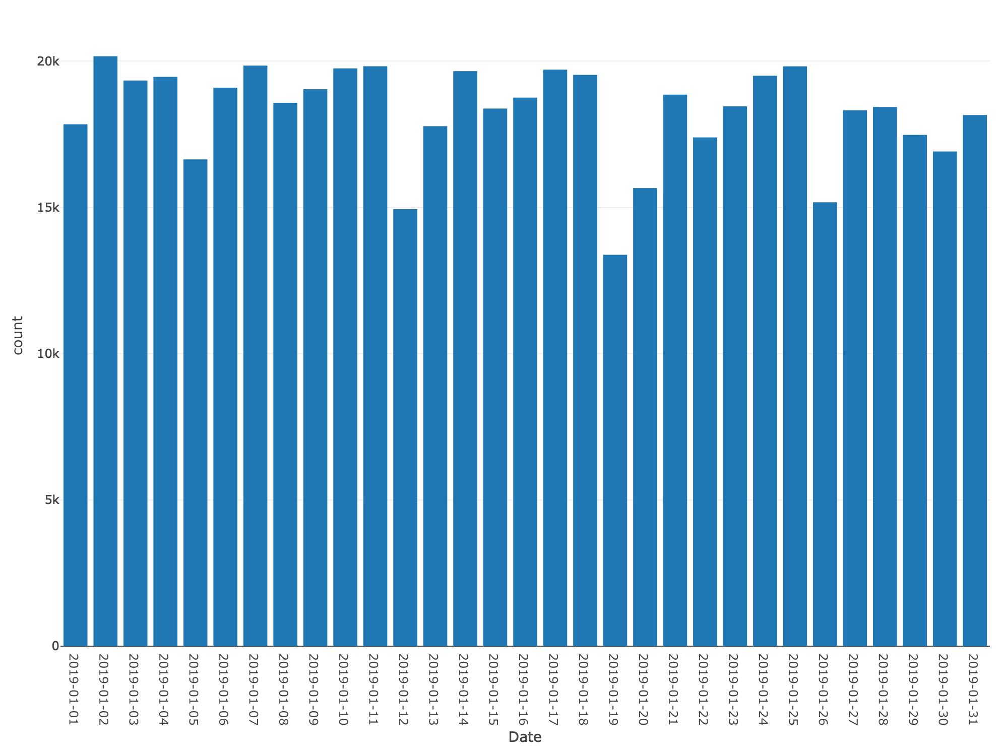
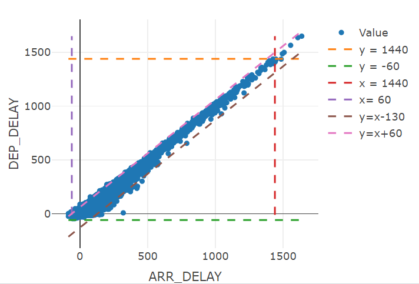
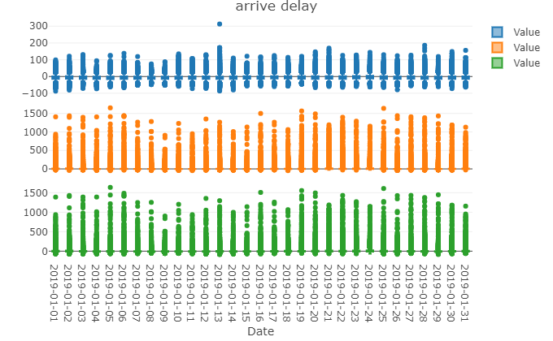

# Introduction

Outliers usually refer to points in the data that do not meet the characteristic rules, and are usually caused by experimental errors or incorrect inputs, including erroneous values or outliers that deviate from the mean. In data processing, outliers will greatly affect the results of regression or classification. Therefore, in the early stages of data processing, the detection and removal of outliers is inevitable. 

In this project, our goal was to employ various methods for identifying anomalous observations and analyzing outliers within a dataset on flight delays. In the first part, we employed traditional outlier detection tests, utilizing descriptive statistics to pinpoint outliers and presenting them visually. In the second part, we employed four anomaly detection models to identify outliers, accompanied by explanations for why these observations are considered outliers. Furthermore, our target audience comprises individuals with a foundational understanding of Probability and Statistics, aiming to facilitate their comprehension of outlier detection methodologies. 

```{r setup, include=FALSE}
knitr::opts_chunk$set(echo = FALSE, warning = FALSE)
library(dplyr)
library(plotly)
library(purrr)
library(tidyverse)
library(MASS)
library(Matrix)
library(dbscan)
library(randomForest)
library(IsolationForest)
library(kableExtra)
library(htmlwidgets)
library(webshot)

axisfont<-list(size=36)
mars<-list(l=0, r=0, b=0, t=20)
```

# Data Definition
The given data set "Flights1_2019_1" shows some flight delay information in the United States in January 2019. Preliminarily exploring the data and understanding the meaning of variables can help us lock in key information. Below is the data dictionary of metadata.  
```{r}
flights_1 <- read.csv("Flights1_2019_1.csv", header = TRUE)
flights <- flights_1[,-18]

#create data variable definition
DataDict<-data.frame(
  Variables=colnames(flights), 
  Example=sapply(flights, function(x) paste(as.character(head(unique(x),2)), collapse = ", ")),
  Number.Missing=sapply(flights, function(x) sum(is.na(x))),
  Meanings=c("Year of departure",
             "The day of week of departure",
             "Departure date",
             "An identification number assigned by US DOT to identify a unique origin airport",
             "An identification number assigned by US DOT to identify a unique origin airport at a given point of time",
             "An identification number assigned by US DOT to identify an origin city market",
             "City name of departure",
             "An identification number assigned by US DOT to identify a unique destination airport",
             "An identification number assigned by US DOT to identify a unique destination airport at a given point of time",
             "an identification number assigned by US DOT to identify a destination city market",
             "City name of arrival",
             "Destination state",
             "Departure delay",
             "Arrival time",
             "Arrival delay",
             "Arrival delay state: 0 if not delay, actual arrival delay if delay",
             "Whether delay is greater than 15 minutes"
            )
)

DataDict%>%remove_rownames()%>%kable(booktabs = TRUE,caption = "Data Dictionary")%>%
  kable_styling(font_size=10, latex_options=c("striped","scale_down","hold_position"))%>%
  column_spec(4, width = "30em")%>%
  row_spec(0,bold=TRUE)
```

Among them, "ORIGIN_AIRPORT_ID," "ORIGIN_AIRPORT_SEQ_ID," share a one-to-one relationship, allowing us to remove "ORIGIN_AIRPORT_SEQ_ID,". Similarly, "DEST_AIRPORT_ID," "DEST_AIRPORT_SEQ_ID," exhibit a one-to-one relationship, permitting the removal of "DEST_AIRPORT_SEQ_ID,".A city can have multiple airports and the weather condition in a city . While "ARR_DELAY," "ARR_DELAY_NEW," and "ARR_DEL15" do not match exactly, they offer similar information. By using the "ARR_DELAY" data, we can infer "ARR_DELAY_NEW" and "ARR_DEL15." Consequently, these two columns can be omitted. Following these adjustments, the dataset that initially comprised 18 columns now contains only 12 columns.
```{r}
flights<- na.omit(flights)
index<-c(1,5,9,16,17)
flights<-flights[,-index]
flights$ARR_TIME <- sprintf("%04d",flights$ARR_TIME)
flights$ARR_TIME <- paste0(substring(flights$ARR_TIME, 1, 2), ":", substring(flights$ARR_TIME, 3, 4))
flights$ARR_TIME <- strptime(flights$ARR_TIME, format = "%H:%M") 
flights$ARR_TIME <- format(flights$ARR_TIME, format = "%H:%M")
```

# Visualization

Based on Figure 1, we observe that the daily number of flights does not vary significantly, consistently exceeding 15,000 flights each day. Saturdays tend to have fewer flights compared to other days of the week.

```{r}
numb<-group_by(flights,FL_DATE)%>%summarise(count=n())
png("The Number of Flight.png")
p0<-plot_ly(numb, x = ~FL_DATE, y = ~count, type = "bar", name = "Value") %>%
  layout(xaxis = list(title = "Date"), yaxis = list(title = "count"))
saveWidget(widget = p0, file = "./Figures/num_f.html")
shots<-webshot(url = "./Figures/num_f.html", file = "./Figures/num_f.png", delay = 1, zoom = 2)
```

```{r, echo=FALSE,fig.align='center', fig.cap = "The Number of Flight", out.height="3in", out.width="3in"}

```

To identify outliers, it's crucial to leverage key variables like arrival delay and departure delay. These variables are particularly informative because a flight cannot arrive excessively early or depart excessively late. As a result, we crafted Figure 2 to visualize the distribution of arrival delays.

\begin{minipage}[t]{0.7\textwidth}
```{r}
numb3<-group_by(flights,ARR_DELAY)%>%summarise(count=n())
p1<-plot_ly(numb3, x = ~ARR_DELAY, y = ~count, type = "bar", name = "Value") %>%
  layout(title = "The distribution of arrive delay", xaxis = list(title = "Date"), yaxis = list(title = "count"))
numb4<-group_by(flights,DEP_DELAY)%>%summarise(count=n())
p2<-plot_ly(numb3, x = ~ARR_DELAY, y = ~count, type = "bar", name = "Value") %>%
  layout(title = "The distribution of arrive delay", xaxis = list(title = "Date"), yaxis = list(title = "count"))
p3<-subplot(p1, p2, nrows = 2, titleX = TRUE, shareX = TRUE)
saveWidget(widget = p3, file = "./Figures/dis_del.html")
shots<-webshot(url = "./Figures/dis_del.html", file = "./Figures/dis_del.png", delay = 1, zoom = 2)
```

```{r, echo=FALSE,fig.align='center', fig.cap = "The Distribution of Delay", out.height="3in", out.width="3in"}
knitr::include_graphics("./Figures/dis_del.png")
```
\end{minipage}
\begin{minipage}[t]{0.3\textwidth}
\vspace{13pt}
Upon examining Figure 2, a noticeable decline is evident when the arrival delay is less than -58 and the departure delay is less than -53. This observation underscores the significance of these thresholds in understanding the distribution and potential outliers in the context of flight delays.
\end{minipage}

We also need to consider the time difference between arrival delay and departure delay. For instance, if a flight's departure delay is 1440 minutes and its arrival delay is 0 minutes, it becomes challenging to explain why the actual flight time is a day earlier than the expected flight time. Therefore, we identify data points where the time difference is excessively large as potential outliers, even if the arrival and departure delays individually seem reasonable. Figure 3 illustrates the distribution of these time differences.

:::::: {.cols data-latex=""}

::: {.col data-latex="{0.49\textwidth}"}
```{r}
numb1<-flights$ARR_DELAY-flights$DEP_DELAY%>%as.data.frame()
colnames(numb1)<-c("dif")
sample_mean <- mean(numb1$dif, na.rm = TRUE)
sample_sd <- sd(numb1$dif, na.rm = TRUE)
numb1$FL_DATE<-flights$FL_DATE
numb2<-group_by(numb1,dif)%>%summarise(count=n())
p4<-plot_ly(numb2, x = ~dif, y = ~count, type = "bar", name = "Value") %>%
  layout(xaxis = list(title = "Time Difference"), yaxis = list(title = "count"))
saveWidget(widget = p4, file = "./Figures/dis_gap.html")
shots<-webshot(url = "./Figures/dis_gap.html", file = "./Figures/dis_gap.png", delay = 1, zoom = 2)
```

```{r, echo=FALSE, out.width='50%',fig.align='center', fig.cap = "The Distribution of Time Difference"}
knitr::include_graphics("./Figures/dis_gap.png")
```
:::

::: {.col data-latex="{0.02\textwidth}"}
\ 
<!-- an empty Div (with a white space), serving as
a column separator -->
:::

::: {.col data-latex="{0.49\textwidth}"}
```{r}
p5<-plot_ly(flights, x = ~ARR_DELAY, y = ~DEP_DELAY, type = "scatter",mode = "markers", name = "Value") %>%
layout(xaxis = list(title = "ARR_DELAY"), yaxis = list(title = "DEP_DELAY"))%>%
add_lines(y = 1440, mode = "lines", name = "y = 1440", line = list(dash = 'dash')) %>%
  add_lines(y = -60, mode = "lines", name = "y = -60", line = list(dash = 'dash'))%>%
  add_lines(x = 1440, mode = "lines", name = "x = 1440", line = list(dash = 'dash'))%>%
  add_lines(x = -60 , mode = "lines", name = "x= 60", line = list(dash = 'dash'))%>%
  add_lines(x = flights$ARR_DELAY, y=flights$ARR_DELAY-130,mode = "lines", name = "y=x-130", line = list(dash = 'dash'))%>%
  add_lines(x = flights$ARR_DELAY, y=flights$ARR_DELAY+60 , mode = "lines", name = "y=x+60", line = list(dash = 'dash'))
```

```{r, out.width='70%',echo=FALSE, fig.align='center', fig.cap = "Delay Time"}

```
:::
::::::

We've crafted a scatter plot to illustrate both arrival delay and departure delay, along with the time gap between them, all within the same chart. To enhance the insights, we've incorporated six guiding lines. The lines 'x=-60' and 'x=1440' help identify flights arriving more than 60 minutes ahead of schedule and those arriving later than planned by 1440 minutes, respectively. Similarly, the lines 'y=-60' and 'y=1440' assist in spotting departures occurring earlier than the scheduled time by 60 minutes and later by 1440 minutes. The lines 'y=x+60' and 'y=x+130' highlight flights where the time difference between departure and arrival seems unusual. Points falling outside the hexagon formed by these lines could potentially be considered outliers.

:::::: {.cols data-latex=""}

::: {.col data-latex="{0.28\textwidth}"}
We then crafted a box plot Figure 5 to illustrate the correlation between time differences, arrival delays, departure delays, and the corresponding days. However, a substantial number of data points fall outside the upper and lower quartile ranges.
:::

::: {.col data-latex="{0.02\textwidth}"}
\ 
<!-- an empty Div (with a white space), serving as
a column separator -->
:::

::: {.col data-latex="{0.7\textwidth}"}
```{r}
numb1<-flights$ARR_DELAY-flights$DEP_DELAY%>%as.data.frame()
numb1$FL_DATE<-flights$FL_DATE
p6<-plot_ly(numb1, x = ~FL_DATE, y = ~., type = "box", name = "Value") %>%
layout(title = "Time different of delay", xaxis = list(title = "Date"), yaxis = list(title = "Time different"))
```

```{r}
p7<-plot_ly(flights, x = ~FL_DATE, y = ~DEP_DELAY, type = "box", name = "Value") %>%
layout(title = "departure delay", xaxis = list(title = "Date"), yaxis = list(title = "Time"))
```

```{r}
p8<-plot_ly(flights, x = ~FL_DATE, y = ~ARR_DELAY, type = "box", name = "Value") %>%
layout(title = "arrive delay", xaxis = list(title = "Date"), yaxis = list(title = "Time"))
p9<-subplot(p6,p7,p8, nrows = 3, titleX = TRUE, shareX = TRUE)
```

```{r, echo=FALSE,out.height="3in", out.width="3in", fig.align='center', fig.cap = "Box Chart"}

```
:::
::::::

After visualizing, we found the variables, like "Data", "Time", are useless. In addition, this data set has too many samples to analysis. Therefore, the next step is to build a new data set. Considering that many flights share the same departure airport and arrival airport, these flights are on the same route and under the same management conditions. We group the metadata by departure and arrival airports so that each route contains average delay information for all flights operating on that route.The reason for calculating the average information is it can help us rule out some extreme situations, such as severe weather. We form new variables for our subset through calculations between metadata variables. The data dictionary of subset is as follows.
```{r}
data <- group_by(flights,ORIGIN_AIRPORT_ID,DEST_AIRPORT_ID) %>% 
  summarise(DEP_delay = mean(DEP_DELAY), 
            ARR_delay = mean(ARR_DELAY), 
            DIF = ARR_delay - DEP_delay,
            DEPdelay=sum(DEP_DELAY <=0)/n(),
            ARRdelay=sum(ARR_DELAY <=0)/n(),
            delay_15_rate = sum(ARR_DELAY >=15)/n())
df1 <- data[,3:8] 


DataDict_subset<-data.frame(
  Variables=colnames(df1), 
  Example=sapply(df1, function(x) paste(as.character(head(unique(x),2)), collapse = ", ")),
  Number.Missing=sapply(df1, function(x) sum(is.na(x))),
  Meanings=c("Departure delay",
             "Arrival delay",
             "Trip delay time",
             "On-time departure rate of aircraft on specific routes",
             "On-time arrival rate of aircraft on specific routes",
             "The proportion of arrival delays for aircraft on specific routes exceeding 15 minutes"
            )
)

DataDict_subset%>%remove_rownames()%>%kable(booktabs = TRUE,caption = "Data Dictionary for using dataset")%>%
  kable_styling(font_size=10, latex_options=c("striped","scale_down","hold_position"))%>%
  column_spec(4, width = "30em")%>%
  row_spec(0,bold=TRUE)
```
\begin{minipage}[t]{0.7\textwidth}
```{r}
df1<-scale(df1)%>%as.data.frame()
p10<-plot_ly(df1, y = ~DEP_delay, type = "box",name = "DEP_delay") %>%
  add_trace(y = ~ARR_delay,  type = "box",name = "ARR_delay") %>%
  add_trace(y = ~DIF, type = "box", name = "DIF") %>%
  add_trace(y = ~DEPdelay, type = "box",name = "DEPdelay") %>%
  add_trace(y = ~ARRdelay, type = "box",name = "ARRdelay") %>%
  add_trace(y = ~delay_15_rate, type = "box", name = "delay_15_rate") 
saveWidget(widget = p10, file = "./Figures/boxall.html")
shots<-webshot(url = "./Figures/boxall.html", file = "./Figures/boxall.png", delay = 1, zoom = 2)
```

```{r, echo=FALSE, out.width='70%',fig.align='center', fig.cap = "box chart of all variabels"}
knitr::include_graphics("./Figures/boxall.png")
```
\end{minipage}
\begin{minipage}[t]{0.3\textwidth}
\vspace{13pt}
We generated a box plot using a new dataset. To enhance the visibility of outliers, we standardized the data. Upon inspecting the chart, we identified points lying beyond the second and third quartiles, classifying them as outliers.
\end{minipage}

# Method

## Distance

A quick way to screen out anomalous observations is to compare distances. A quick way to screen out anomalous observations is to compare distances. For example, we want to calculate how far a sample point p$x=(x_1,...x_n)$ is from a distribution with mean $\mu=(y_1,...,y_n)$to verify whether p belongs to this distribution. One of the most common methods is to calculate the distance between p and the mean of the sample and compare it with the standard deviation of the sample. For a multidimensional data, if each variable shares the same unit of measurement, then the data set can be visually viewed as a sphere, and Euclidean distance can be applied well with the given Euclidean distance formula $d_E=\sqrt{\sum_{i=1}^{n}(x_i-y_i)^2}$  
However, Euclidean distance has problems with certain multidimensional data. Considering the formula of Euclidean distance, we can easily find that Euclidean distance treats every eigenvalue equally. A simple example is when we have a data with two columns of feature values, the first column is in minutes and the second column is in hours. When we apply the Euclidean distance formula, the impact or contribution of the first column is significantly stronger than that of the second column. This result makes the second column of information seem insignificant. The influence of the second column features is reduced when judging outliers. If the data distribution is not spherical, such as an ellipsoid, the lengths of the visual data on the long and short axes are obviously different, and the standard deviation has a scale problem, we should improve the Euclidean distance.  
Mahalanobis Distance can be seen as a correction of Euclidean distance, which corrects the problem of inconsistent scales of various dimensions in Euclidean distance. Given Mahalanobis Distance $d_M=\sqrt{(x-\mu)^{\intercal}\Sigma^{-1}(x-\mu)}$, where $\Sigma$ is the covariance matrix of the sample. When the inverse of $\Sigma$ exists, the Mahalanobis distance is insensitive to the standard deviation scale issue, the versatility is improved.
Mahalanobis distance is more suitable for our subset because the subset we are using suffers from scale issues. Delay is measured in minutes, while on-time performance is a ratio between 0 and 1. If we ignore the scale issue, the consequence is that the outliers found are only based on some particular features.

```{r}
Distance <- function(df){
  mean_vector <- colMeans(df)
  S <- cov(df)
  S_reg <- nearPD(S)$mat
  d_square <- mahalanobis(df,center = mean_vector, cov = S_reg)
  d_M = sqrt(d_square)
  plot(d_M, main = "Mahalanobis distances vs. index")
  return(d_square)
}

d_square <- Distance(df1)
points(which(sqrt(d_square) > 5), sqrt(d_square[sqrt(d_square) > 5]), col = "red", pch = 16)

plot_d_square <- data.frame(d_square)
ggplot(plot_d_square, aes(x = d_square)) +
  geom_histogram(binwidth = 1, fill = "lightblue", color = "black", boundary = 0) +
  labs(title = "Histogram of Mahalanobis Distances",
       x = "Squared Mahalanobis Distance",
       y = "Frequency")

plot_d <- data.frame(d = sqrt(d_square))
ggplot(plot_d, aes(x = d)) +
  geom_histogram(binwidth = 0.1, fill = "lightblue", color = "black", boundary = 0) +
  labs(title = "Histogram of Mahalanobis Distances",
       x = "Mahalanobis Distance",
       y = "Frequency")

d_clean <- sqrt(d_square)[sqrt(d_square) < 5]
d_cleandf <- data.frame(d_clean)
ggplot(d_cleandf, aes(x = d_clean)) +
  geom_histogram(aes(y=..density..),
    binwidth = 0.1, fill = "lightblue", color = "black", boundary = 0) +
  labs(title = "Histogram of Mahalanobis Distances (Excluding Outliers)",
       x = "Mahalanobis Distance",
       y = "Density") +
  geom_density(alpha=.2, fill="#FF6666")
```

```{r}
dis_colors <- ifelse(sqrt(d_square) > 5, "indianred2", "cyan3")
plot(df1,col = dis_colors)
```


The graph reflects the Mahalanobis distance of each point to the mean. Suppose we set the threshold to 5, and points exceeding the threshold are marked in red. We can see that the Squared Mahalanobis distance in the results conforms to the chi-square distribution, and the Mahalanobis distance basically conforms to the normal distribution with long tail. When we remove the parts that exceed the threshold, the distribution becomes more normal.

## density

# LOF

```{r}
lof_scores <- lof(df1,minPts = 12)
hist(lof_scores, breaks = 10, main = "LOF (minPts = 12)")
outliers_lof <- which(lof_scores > 2)
outliers_scores <- lof_scores[outliers_lof]
lof_colors <- ifelse(lof_scores > 2, "indianred2", "cyan3")
plot(df1,col = lof_colors)

```

#DBSCAN

```{r}
kNNdistplot(scale(df1), minPts = 12)
abline(h = 1.8, lty = 2)
```

```{r}
dbscan_result <- dbscan(scale(df1), eps =1.8, minPts =12)
print(dbscan_result)
```

```{r}
dbscan_colors <- ifelse(dbscan_result$cluster == 0, "indianred2", "cyan3")
plot(df1,col = dbscan_colors)
```


## Isolation Forest

Isolation Forest is a method to quickly identify outliers. In the Isolation Forest algorithm, anomalous observations are defined as points that are easily isolated. From a visualization perspective, these points are sparsely distributed and are points farther away from high-density groups. The idea is similar to density-based methods, but it filters out these outliers in different ways. From a visualization perspective, these points are sparsely distributed and are points farther away from high-density groups. This idea is similar to the density-based method, but it filters out these outliers in different ways. The idea of the algorithm is to use a plane to cut the data space to form two subspaces, and then cut the subspaces separately until each subspace Contains only one data point. A visual example is to imagine the data space as a cake with chocolate chunks scattered on the surface, where the chocolate chunks represent data points. We use a cake knife to cut into the cake until there is only one piece of chocolate on each small component of cake. Those clusters with high density need to be cut many times to ensure that each component contains only one point, while relatively sparsely dispersed points need fewer cuts to stop.  
The Isolation Forest algorithm is roughly divided into two steps. First, iTrees are trained to form an isolation forest, then the data is evaluated, each point is substituted, and the average height is calculated.  
Step 1: When constructing each iTree, N samples are extracted from the training data, and then a feature is randomly selected, selected randomly a cutting point under the feature, the sample is bifurcated, and then divided on the two sides respectively. Repeat the above process on the dataset, directly reach the termination condition that each component has exactly one point. A tree is constructed.  
Step 2: Walk the data down along the corresponding conditional branch in each tree until it reaches the leaf, and record the length of the path passed in the process. An anomaly score is obtained from this. When the score exceeds a certain threshold, it can be determined as an anomalous observation. With $\left| D \right| = n$, the expected length to a random point $p$ in an IsoTree is $c(n)=2H(n-1)-\frac{2(n-1)}{n}$, where $H(n)$ is the $n^{th}$ harmonic number, $H(n)\approx ln(n)+0.577$. Then the normalized anomaly score of $p$, denoted as $a(p)$ has the relationship: $\log_{2}^{a(p)}=-\frac{average\ path\ length}{c(n)}$. So we have $a(p)=2^{-\frac{average\ path\ length}{c(n)}}$. Note that $a(p) \in(0,1)$, when the anomaly score is closer to 1, the behavior of the point is more abnormal.  
The basis for using this algorithm is that the dataset contains a relatively small proportion of outliers and the characteristics of the outliers are obvious. In addition, Isolation Forest is not suitable for high-dimensional data sets. The reason is that in the first cutting step of the algorithm, we always randomly select a dimensional feature. However, for high-dimensional data structures, there may still be a large amount of dimensional information that is not used after the tree is built, resulting in reduced algorithm reliability. Another weakness is that the algorithm is suitable for processing global anomaly and is not sensitive to local anomaly.[@aryal2014improving]

```{r}
train <- IsolationTrees(df1, rFactor=0)
as <- AnomalyScore(df1,train)
outliers_Iso <- which(as$outF>0.5)
outliers_AnomalyScore <- as$outF[outliers_Iso]
isoforest_colors <- ifelse(as$outF>0.5, "indianred2", "cyan3")
plot(df1,col = isoforest_colors)
```

# Summary

In this project, we explored various approaches for outlier detection. Traditional methods offer a straightforward interpretation, making it easy to identify individual points as outliers. However, these methods face challenges when dealing with multiple variables simultaneously. Distance-based methods provide an intuitive understanding, as outliers are typically positioned at the outer edges of the overall dataset.

On the other hand, Local Outlier Factor (LOF) is adept at uncovering local anomalies but may struggle with identifying global outliers effectively. DBScan, while effective in classifying samples at the "tip," outperforms isolation forest in certain scenarios. Isolation Forest, notably, stands out for its independence from distance measures and the absence of parameter selection requirements.

To compare the outcomes of Isolation Forest, DBScan, LOF, and distance-based methods, we calculated the rate of same result between 2 different methods. The concordance rate between Isolation Forest and DBScan is 97.11%, between DBScan and LOF is 98.68%, between LOF and distance-based methods is 97.53%, between Isolation Forest and LOF is 97.04%, and concordance rate between DBScan and distance-based methods is 98.57%, and between Isolation Forest and distance-based methods is 97.58%. The variations in results among different methods stem from the strengths and weaknesses we discussed earlier for each respective approach.

```{r}
m<-cbind(as$outF>0.5,dbscan_result$cluster==0)%>%
  cbind(.,lof_scores > 2)%>%cbind(.,sqrt(d_square) > 5)%>%
  as.data.frame(.)
colnames(m)<-c("isoForest","dbscan","lof","dist")
a<-group_by(m,isoForest,dbscan,lof,dist)%>% 
  summarise(tot=n())
```